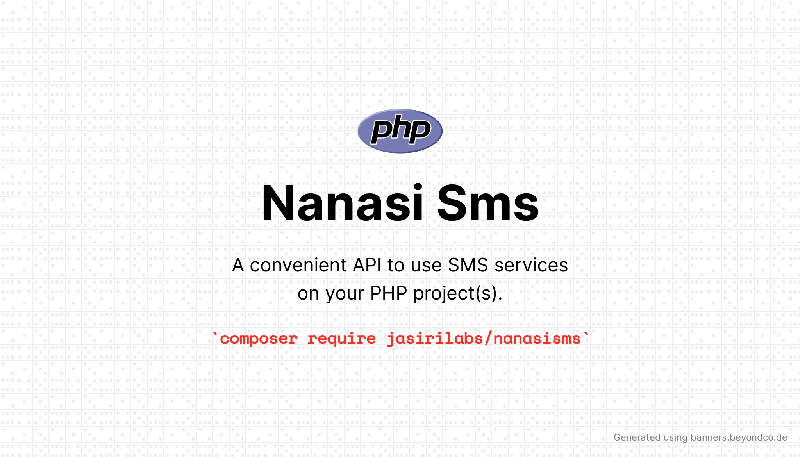

<h1 style="text-align: center;">
Nanasi Sms
</h1>



**Note**
> Feel free to play with the code.

## Get started 

**Warning**
> This is a work in progress.

```php

use JasiriLabs\NanasiSMS\Config;
use JasiriLabs\NanasiSMS\NextSms\NextSmsAdapter;
use JasiriLabs\NanasiSMS\NanasiSMS;

$config = new Config(['username' => 'username', 'password' => 'password']);

$sms = new NanasiSMS(
    new NextSmsAdapter($config),
    []
);


```


```php

$sms->send(['255765975152', '255766073577'], ['Hello Sigma SMS', 'Its working']);

$sms->schedule('255746094190', 'Hello Scheduled SMS', ['date' => '2022-06-30', 'time' => '10:03']);

$sms->deliveryReport(['limit' => 3]) 

$sms->balance()

```


## Contributing 

We value contributions from the community. If you have any questions, please open an issue or pull request.


## Security Vulnerabilities

In case of any security issue just email us at  [support@jasirilabs.com](mailto:support@jasirilabs.com)


## License

    This project is licensed under the MIT license.
    See the LICENSE file for more information.


